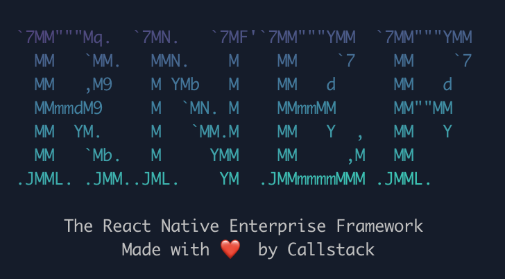

<p align="center">
  <picture>
    <source media="(prefers-color-scheme: dark)" srcset="./docs/assets/rnef.png">
    
  </picture>
</p>
<h1 align="center" style="border-bottom: 0px">
  React Native Enterprise Framework<br />
</h1>
<p align="center">
  This is a React Native framework for developing large, modular applications for all the platforms supported by React Native.
</p>

---

## Features

- 🐾 Incremental adoption in native apps thanks to our simplified brownfield approach
- 🔬 Web-like DX thanks to advanced native build caching hosted on your infra
- 🏰 Pluggable design to leverage out-of-tree platforms, custom bundlers, etc.

## Installation

For new projects you can run:

```
npx create-rnef-app enterprise
```

## Adding to existing projects

1. Copy `.github/` files from [`@rnef/template-default`](https://github.com/callstack/rnef/tree/main/templates/rnef-template-default/), [`@rnef/plugin-platform-android`](https://github.com/callstack/rnef/tree/main/packages/plugin-platform-android/template), and [`@rnef/plugin-platform-ios`](https://github.com/callstack/rnef/tree/main/packages/plugin-platform-ios/template). They contain necessary actions with remote builds for iOS and Android and sample workflows for running those actions. In the upcoming future we'll release reusable actions so you will only need to integrate them into your workflows.

1. Install deps:

   ```sh
   npm install --dev @rnef/cli @rnef/plugin-metro @rnef/plugin-platform-android @rnef/plugin-platform-ios @actions/core @actions/github
   ```

1. Remove `@react-native-community/cli` and related packages.

1. Add `.rnef/` folder with caches to `.gitignore`:

   ```
   .rnef/
   ```

1. Add `rnef.config.mjs` file:

   ```mjs
   import { pluginPlatformIOS } from '@rnef/plugin-platform-ios';
   import { pluginPlatformAndroid } from '@rnef/plugin-platform-android';
   import { pluginMetro } from '@rnef/plugin-metro';

   export default {
     plugins: {
       metro: pluginMetro(),
     },
     platforms: {
       ios: pluginPlatformIOS(),
       android: pluginPlatformAndroid(),
     },
   };
   ```

1. Update Android files:

   In `android/app/build.gradle` uncomment the `cliFile` and update with the new path:

   ```diff
   -// cliFile = file("../../node_modules/react-native/cli.js")
   +cliFile = file("../../node_modules/@rnef/cli/src/bin.js")
   ```

   In `android/settings.gradle` change:

   ```diff
   -extensions.configure(com.facebook.react.ReactSettingsExtension){ ex -> ex.autolinkLibrariesFromCommand() }
   +extensions.configure(com.facebook.react.ReactSettingsExtension){ ex -> ex.autolinkLibrariesFromCommand(['npx', 'rnef', 'config', '-p', 'android']) }
   ```

1. Update iOS files:

   In `ios/Podfile` change:

   ```diff
   -config = use_native_modules!
   +config = use_native_modules!(['npx', 'rnef', 'config', '-p', 'ios'])
   ```

   In "Bundle React Native code and images" Build Phase in Xcode add:

   ```diff
   set -e
   +if [[ -f "$PODS_ROOT/../.xcode.env" ]]; then
   +source "$PODS_ROOT/../.xcode.env"
   +fi
   +if [[ -f "$PODS_ROOT/../.xcode.env.local" ]]; then
   +source "$PODS_ROOT/../.xcode.env.local"
   +fi
   +export CONFIG_CMD="dummy-workaround-value"
   +export CLI_PATH="$("$NODE_BINARY" --print "require('path').dirname(require.resolve('@rnef/cli/package.json')) + '/dist/src/bin.js'")"
   WITH_ENVIRONMENT="$REACT_NATIVE_PATH/scripts/xcode/with-environment.sh"
   ```

1. Cleanup native files:

   ```sh
   git clean -fdx ios/ android/
   ```

1. Run new commands:

   ```sh
   npx rnef run:android
   npx rnef run:ios
   ```

   Additionally rename flags:

   - `--mode` to `--variant` for Android commands
   - `--mode` to `--configuration` for iOS commands
   - `--buildFolder` to `--build-folder` for iOS commands
   - `--destination` to `--destinations` for iOS commands
   - `--appId` to `--app-id` for Android commands
   - `--appIdSuffix` to `--app-id-suffix` for Android commands

1. Configure GitHub Actions for remote builds.
