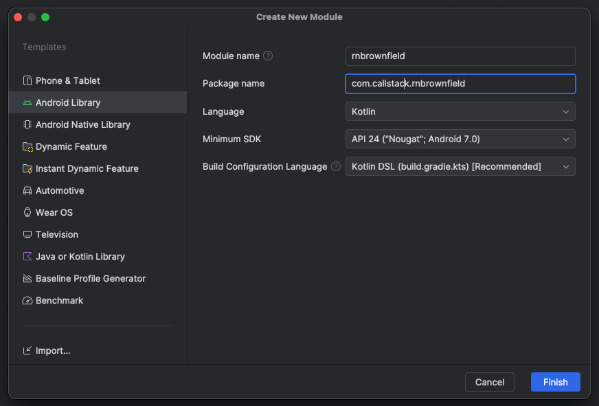

# Adding React Native to Android app

React Native Enterprise Framework helps you package your React Native code into files that your iOS and Android apps can use. For Android, it creates an `.aar` file that you can easily add to your app.

To add React Native to your Android app, we'll package your React Native code into an AAR. This way, you don't need to set up Node.js in your main app. Here's how to do it:

## 1. Create a New Android Library Module

First, we'll create a new Android library module in your React Native project. This module will contain your React Native UI and provide APIs for loading it in your native Android app.

1. Open your React Native project's `android` folder in Android Studio
1. Go to File → New Module → Android Library
   
1. After the sync completes, run your React Native app to make sure everything works
1. Test the build by running `./gradlew assembleRelease` in the android directory

## 2. Set Up the AAR Gradle Plugin

We need a special Gradle plugin to create an AAR that includes all dependencies. We'll use the `brownfield-gradle-plugin` plugin from Callstack.

1. Add the gradle plugin dependency to your `android/build.gradle`:

   ```groovy title="android/build.gradle" {3-10,15}
   buildscript {
       repositories {
           google()
           mavenCentral()
       }
       dependencies {
           classpath("com.callstack.react:brownfield-gradle-plugin:0.3.0")
       }
   }
   ```

1. Add the plugin to your `rnbrownfield/build.gradle.kts`:

   ```groovy title="rnbrownfield/build.gradle.kts" {5}
   plugins {
       id("com.android.library")
       id("org.jetbrains.kotlin.android")
       id("com.facebook.react")
       id("com.callstack.react.brownfield")
   }
   ```

1. Add autolinking setup to the `react` block in `rnbrownfield/build.gradle.kts`:

   ```groovy title="rnbrownfield/build.gradle.kts" {1,3}
   react {
       autolinkLibrariesWithApp()
   }
   ```

1. Run `./gradlew assembleRelease` to verify the setup

   

## 3. Add React Native Dependencies

Add the required React Native dependencies to your `rnbrownfield/build.gradle.kts`:

```groovy title="rnbrownfield/build.gradle.kts" {2-3}
dependencies {
    api("com.facebook.react:react-android:0.77.0")
    api("com.facebook.react:hermes-android:0.77.0")
}
```

After adding these, sync your project and run `./gradlew assembleRelease` to verify everything works.

## 4. Create the React Native Host Manager

Create a new file called `ReactNativeHostManager.kt` in your `rnbrownfield` module:

```kotlin
import android.app.Application
import com.facebook.react.ReactNativeHost
import com.facebook.react.ReactPackage
import com.facebook.react.PackageList
import com.facebook.react.ReactApplication
import com.facebook.react.ReactHost
import com.facebook.react.defaults.DefaultNewArchitectureEntryPoint.load
import com.facebook.react.defaults.DefaultReactHost.getDefaultReactHost
import com.facebook.react.defaults.DefaultReactNativeHost
import com.facebook.react.soloader.OpenSourceMergedSoMapping
import com.facebook.soloader.SoLoader

class ReactNativeHostManager {
    companion object {
        val shared: ReactNativeHostManager by lazy { ReactNativeHostManager() }
        private var reactNativeHost: ReactNativeHost? = null
        private var reactHost: ReactHost? = null
    }

    fun getReactNativeHost(): ReactNativeHost? {
        return reactNativeHost
    }

    fun getReactHost(): ReactHost? {
        return reactHost
    }

    fun initialize(application: Application) {
        if (reactNativeHost != null && reactHost != null) {
            return
        }

        SoLoader.init(application, OpenSourceMergedSoMapping)
        if (BuildConfig.IS_NEW_ARCHITECTURE_ENABLED) {
            // If you opted-in for the New Architecture, we load the native entry point for this app.
            load()
        }

        val reactApp = object : ReactApplication {
            override val reactNativeHost: ReactNativeHost =
                object : DefaultReactNativeHost(application) {
                    override fun getPackages(): MutableList<ReactPackage> {
                        return PackageList(application).packages
                    }

                    override fun getJSMainModuleName(): String = "index"
                    override fun getBundleAssetName(): String = "index.android.bundle"

                    override fun getUseDeveloperSupport() = BuildConfig.DEBUG

                    override val isNewArchEnabled: Boolean = BuildConfig.IS_NEW_ARCHITECTURE_ENABLED
                    override val isHermesEnabled: Boolean = BuildConfig.IS_HERMES_ENABLED
                }

            override val reactHost: ReactHost
                get() = getDefaultReactHost(application, reactNativeHost)
        }

        reactNativeHost = reactApp.reactNativeHost
        reactHost = reactApp.reactHost
    }
}
```

Update your `rnbrownfield/build.gradle.kts` to use Java 17:

```groovy title="rnbrownfield/build.gradle.kts" {3-4,7}
android {
    compileOptions {
        sourceCompatibility = JavaVersion.VERSION_17
        targetCompatibility = JavaVersion.VERSION_17
    }
    kotlinOptions {
        jvmTarget = "17"
    }
}
```

Add build configuration fields:

```groovy title="rnbrownfield/build.gradle.kts" {4-5}
android {
    defaultConfig {
        minSdk = 24

        buildConfigField("boolean", "IS_NEW_ARCHITECTURE_ENABLED", properties["newArchEnabled"].toString())
        buildConfigField("boolean", "IS_HERMES_ENABLED", properties["hermesEnabled"].toString())
    }
}
```

## 5. Create the React Native Entry Point

Create a new file called `RNViewFactory.kt` to wrap your React Native UI in a `FrameLayout`:

```kotlin title="RNViewFactory.kt"
import android.content.Context
import android.os.Bundle
import android.widget.FrameLayout
import androidx.fragment.app.FragmentActivity
import androidx.lifecycle.DefaultLifecycleObserver
import androidx.lifecycle.LifecycleOwner
import com.facebook.react.ReactDelegate
import com.facebook.react.ReactInstanceManager
import com.facebook.react.ReactRootView

object RNViewFactory {
    fun createFrameLayout(
        context: Context,
        activity: FragmentActivity,
        initialParams: Bundle? = null,
    ): FrameLayout {
        val componentName = "BrownFieldTest"
        val reactHost = ReactNativeHostManager.shared.getReactHost()

        if (BuildConfig.IS_NEW_ARCHITECTURE_ENABLED) {
            val reactDelegate = ReactDelegate(activity, reactHost!!, componentName, initialParams)
            val lifecycleObserver = getLifeCycleObserver(reactDelegate)

            activity.lifecycle.addObserver(lifecycleObserver)
            reactDelegate.loadApp()
            return reactDelegate.reactRootView as FrameLayout
        }

        val instanceManager: ReactInstanceManager? = ReactNativeHostManager.shared.getReactNativeHost()?.reactInstanceManager
        val reactView = ReactRootView(context)
        reactView.startReactApplication(
            instanceManager,
            componentName,
            initialParams,
        )
        return reactView
    }

    private fun getLifeCycleObserver(reactDelegate: ReactDelegate): DefaultLifecycleObserver {
        return object : DefaultLifecycleObserver {
            override fun onResume(owner: LifecycleOwner) {
                reactDelegate.onHostResume()
            }

            override fun onPause(owner: LifecycleOwner) {
                reactDelegate.onHostPause()
            }

            override fun onDestroy(owner: LifecycleOwner) {
                reactDelegate.onHostDestroy()
                owner.lifecycle.removeObserver(this)
            }
        }
    }
}
```

## 6. Configure Maven Publishing

Add the Maven publish plugin to your `rnbrownfield/build.gradle.kts`:

```groovy title="rnbrownfield/build.gradle.kts" {6}
plugins {
    id("com.android.library")
    id("org.jetbrains.kotlin.android")
    id("com.facebook.react")
    id("com.callstack.react.brownfield")
    `maven-publish`
}
```

Configure the publishing settings:

```groovy title="rnbrownfield/build.gradle.kts"
publishing {
    publications {
        create<MavenPublication>("mavenAar") {
            groupId = "com.callstack"
            artifactId = "rnbrownfield"
            version = "0.0.1-local"
            afterEvaluate {
                from(components.getByName("default"))
            }

            pom {
                withXml {
                    /**
                     * As a result of `from(components.getByName("default")` all of the project
                     * dependencies are added to `pom.xml` file. We do not need the react-native
                     * third party dependencies to be a part of it as we embed those dependencies.
                     */
                    val dependenciesNode = (asNode().get("dependencies") as groovy.util.NodeList).first() as groovy.util.Node
                    dependenciesNode.children()
                        .filterIsInstance<groovy.util.Node>()
                        .filter { (it.get("groupId") as groovy.util.NodeList).text() == rootProject.name }
                        .forEach { dependenciesNode.remove(it) }
                }
            }
        }
    }

    repositories {
        mavenLocal() // Publishes to the local Maven repository (~/.m2/repository by default)
    }
}

val moduleBuildDir: Directory = layout.buildDirectory.get()

/**
 * As a result of `from(components.getByName("default")` all of the project
 * dependencies are added to `module.json` file. We do not need the react-native
 * third party dependencies to be a part of it as we embed those dependencies.
 */
tasks.register("removeDependenciesFromModuleFile") {
    doLast {
        file("$moduleBuildDir/publications/mavenAar/module.json").run {
            val json = inputStream().use { JsonSlurper().parse(it) as Map<String, Any> }
            (json["variants"] as? List<MutableMap<String, Any>>)?.forEach { variant ->
                (variant["dependencies"] as? MutableList<Map<String, Any>>)?.removeAll { it["group"] == rootProject.name }
            }
            writer().use { it.write(JsonOutput.prettyPrint(JsonOutput.toJson(json))) }
        }
    }
}

tasks.named("generateMetadataFileForMavenAarPublication") {
   finalizedBy("removeDependenciesFromModuleFile")
}
```

## 7. Set up RNEF for AAR generation

1. Add `@rnef/plugin-brownfield-android` to your dependencies
1. Update your `rnef.config.mjs`:

   ```js title="rnef.config.mjs"
   import { pluginBrownfieldAndroid } from '@rnef/plugin-brownfield-android';

   export default {
     plugins: [pluginBrownfieldAndroid()],
   };
   ```

1. Run this command to generate the final AAR:

   ```sh title="Terminal"
   rnef package:aar --variant Release --module-name rnbrownfield
   ```

1. Once the AAR is created, publish it to local Maven registry to be consumable by the native app:

   ```sh title="Terminal"
   rnef publish-local:aar --module-name rnbrownfield
   ```

## 8. Add the AAR to Your Android App

> Note: You'll need an existing Android app or create a new one in Android Studio.

1. Add the dependency to your app's `build.gradle.kts`:

   ```groovy title="build.gradle.kts" {2}
   dependencies {
       implementation("com.callstack:rnbrownfield:0.0.1-local")
   }
   ```

1. Initialize React Native in your `MainActivity`:

   ```kotlin
   class MainActivity : AppCompatActivity() {
       override fun onCreate(savedInstanceState: Bundle?) {
           super.onCreate(savedInstanceState)
           ReactNativeHostManager.shared.initialize(this.application)
           // ... rest of your onCreate code
       }
   }
   ```

## 9. Show the React Native UI

Create a new `RNAppFragment.kt`:

```kotlin
import android.os.Bundle
import android.view.LayoutInflater
import android.view.View
import android.view.ViewGroup
import androidx.fragment.app.Fragment
import com.callstack.rnbrownfield.RNViewFactory

class RNAppFragment : Fragment() {
    override fun onCreateView(
        inflater: LayoutInflater,
        container: ViewGroup?,
        savedInstanceState: Bundle?,
    ): View? =
        this.context?.let {
            RNViewFactory.createFrameLayout(it)
        }
}
```

Add a button to your `activity_main.xml`:

```xml
<Button
    android:id="@+id/show_rn_app_btn"
    android:layout_width="wrap_content"
    android:layout_height="wrap_content"
    android:text="Show RN App"
    app:layout_constraintBottom_toBottomOf="parent"
    app:layout_constraintEnd_toEndOf="parent"
    app:layout_constraintStart_toStartOf="parent"
    app:layout_constraintTop_toTopOf="parent" />
```

Add a fragment container:

```xml
<FrameLayout
    android:id="@+id/fragmentContainer"
    android:layout_width="match_parent"
    android:layout_height="match_parent" />
```

Update your `MainActivity` to show the fragment:

```kotlin {2,8-13}
class MainActivity : AppCompatActivity() {
    private lateinit var showRNAppBtn: Button

    override fun onCreate(savedInstanceState: Bundle?) {
        super.onCreate(savedInstanceState)
        ReactNativeHostManager.shared.initialize(this.application)

        showRNAppBtn = findViewById(R.id.show_rn_app_btn)
        showRNAppBtn.setOnClickListener {
            supportFragmentManager
                .beginTransaction()
                .replace(R.id.fragmentContainer, RNAppFragment())
                .commit()
        }
    }
}
```

Now you can run your app and test the React Native integration!

> Note: `brownfield-gradle-plugin` copies `.so` files to the `lib` folder. Make sure to add `**/*.so` to your .gitignore file, as to not commit these .so files. The reason is they are auto-generated each time.
